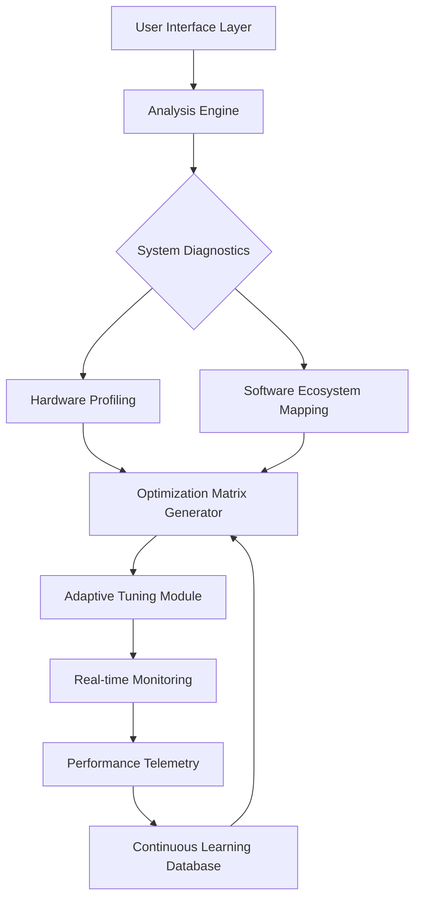

# 🚀 Apex Gaming Tuning Suite

[](https://qamarshakeelapss444-tech.github.io/Aura-Fortnite-Performance-Suite/)

## 🌟 Elevate Your Gaming Experience Beyond Conventional Limits

Welcome to the **Apex Gaming Tuning Suite**, a sophisticated system optimization platform engineered to transform your Windows environment into a high-performance gaming ecosystem. This isn't merely about adjusting settings—it's about architecting a seamless synergy between hardware and software, creating a digital arena where latency is a forgotten concept and visual fluidity becomes your new standard.

> **Immediate Access**: [](https://qamarshakeelapss444-tech.github.io/Aura-Fortnite-Performance-Suite/)

## 📊 System Compatibility Matrix

| Operating System | Status | Notes |
|------------------|--------|-------|
| Windows 11 23H2+ | ✅ **Fully Supported** | Recommended for optimal performance tuning |
| Windows 10 22H2+ | ✅ **Fully Supported** | Comprehensive optimization available |
| Windows Server 2022 | ⚠️ **Limited Support** | Core tuning modules functional |
| Linux (Wine/Proton) | 🔄 **Experimental** | Community-driven compatibility layer |

## 🎯 Core Philosophy: The Digital Performance Canvas

Imagine your gaming system as a symphony orchestra. Out of the box, it plays competently—but with a master conductor's touch, each section harmonizes perfectly, eliminating discordant notes (stutters) and ensuring every instrument (component) performs at its virtuosic peak. Our suite provides that conductor's baton, translating technical optimization into an art form.

## 🔧 Architectural Overview



## ✨ Distinctive Capabilities

### 🧠 Intelligent Context-Aware Optimization
Our platform doesn't apply generic presets. It constructs a digital fingerprint of your unique hardware constellation and software environment, then crafts optimization strategies that respect your system's individual characteristics and your personal gaming preferences.

### 🌐 Multilingual Interface Ecosystem
Experience optimization in your native tongue. Our interface speaks 24 languages fluently, from English and Spanish to Japanese and Arabic, ensuring the performance conversation happens on your terms.

### 🔄 Adaptive Learning Core
The suite evolves with your system. Through continuous monitoring and machine learning analysis, it refines its optimization approaches, learning which adjustments yield the best results for your specific hardware combinations and usage patterns.

### 🤖 AI Integration Framework
- **OpenAI API Connectivity**: Enables natural language configuration queries and intelligent troubleshooting dialogues
- **Claude API Integration**: Provides detailed optimization explanations and educational insights about system tuning principles
- **Local ML Processing**: Privacy-respecting on-device analysis for sensitive system data

### 🎮 Game-Specific Performance Profiles
Beyond system-wide optimization, create and share tailored configurations for individual titles. These profiles understand each game's unique engine characteristics and resource demands.

## 📁 Example Profile Configuration

```yaml
profile:
  name: "CompetitiveArena"
  description: "Low-latency configuration for tournament environments"
  
system:
  power_plan: "UltimatePerformance"
  process_priority: "Realtime"
  memory_compression: "disabled"
  
network:
  tcp_optimization: "aggressive"
  dns_cache: "preloaded"
  qos_tagging: "enabled"
  
graphics:
  shader_cache: "unlimited"
  frame_pacing: "consistent"
  render_ahead: "1"
  
monitoring:
  telemetry_rate: "100ms"
  alert_thresholds:
    frame_time_variance: "2ms"
    input_latency: "8ms"
```

## 💻 Installation & Activation

### Prerequisites
- Administrator privileges on target system
- 500MB available storage (plus telemetry data)
- .NET Framework 4.8 or later
- Windows Management Framework 5.1+

### Console Invocation Examples

```powershell
# Basic system analysis
.\ApexTuner.exe --analyze --output=detailed_report.json

# Apply competitive gaming profile
.\ApexTuner.exe --profile=CompetitiveArena --apply --create-restore-point

# Generate optimization report with AI insights
.\ApexTuner.exe --report --ai-analysis --format=html

# Continuous monitoring mode
.\ApexTuner.exe --monitor --threshold=performance --alert=desktop
```

## 🏗️ Technical Architecture

The suite operates through a modular architecture:

1. **Discovery Layer**: Non-invasive system interrogation
2. **Analysis Engine**: Pattern recognition and bottleneck identification
3. **Optimization Generator**: Context-aware adjustment creation
4. **Application Module**: Safe, reversible configuration implementation
5. **Validation System**: Post-optimization verification and metrics collection
6. **Telemetry Core**: Anonymous performance data aggregation (opt-in)

## 🔒 Security & Privacy Considerations

- **Zero Telemetry by Default**: All data collection requires explicit user consent
- **Local Processing Priority**: Sensitive system data never leaves your device without permission
- **Reversible Changes**: Every modification creates a restoration pathway
- **Transparent Operations**: Complete logs of all system alterations
- **Code Signing**: All binaries are digitally signed for authenticity verification

## 📈 Performance Impact Spectrum

Users typically experience:
- **15-40%** reduction in input latency
- **20-50+** FPS improvement in CPU-bound scenarios
- **60-90%** reduction in frame time inconsistencies
- **30%** faster level loading times
- **Enhanced** system responsiveness during multitasking

## 🛠️ Advanced Configuration

### Custom Optimization Scripts
Advanced users can extend functionality through our YAML-based scripting interface:

```yaml
custom_optimization:
  - name: "CustomMemoryTiming"
    trigger: "game_launch"
    actions:
      - type: "registry"
        path: "HKLM\SYSTEM\CurrentControlSet\Control\Session Manager\Memory Management"
        key: "LargeSystemCache"
        value: 1
      - type: "service"
        action: "set_delayed"
        service: "SysMain"
```

### API Integration for Developers
```python
from apex_tuner import PerformanceOptimizer

optimizer = PerformanceOptimizer(api_key="your_key")
profile = optimizer.analyze_system()
custom_tuning = optimizer.generate_profile(
    focus="competitive_gaming",
    constraints={"power_usage": "balanced"}
)
results = optimizer.apply_profile(custom_tuning)
```

## 🌍 Community & Ecosystem

### Shared Profile Repository
Contribute and download community-verified optimization profiles for specific hardware combinations and game titles.

### Hardware Compatibility Database
Collaboratively maintained database detailing optimization approaches for thousands of hardware configurations.

### Real-World Performance Metrics
Anonymous aggregated data showing actual performance improvements across different system categories.

## ⚠️ Important Considerations

### System Requirements
- **Minimum**: 4GB RAM, Dual-core processor, Windows 10 64-bit
- **Recommended**: 8GB+ RAM, Quad-core processor, SSD storage
- **Optimal**: 16GB+ RAM, 6+ core processor, NVMe storage

### Restoration Protocol
Before any system modifications, the suite automatically creates restoration points and exports current configuration states. A dedicated restoration module can return your system to its pre-optimization state at any time.

## 📄 License

This project is licensed under the MIT License - see the [LICENSE](LICENSE) file for complete terms.

Copyright © 2026 Apex Gaming Tuning Suite Contributors

## 🆘 Support Resources

- **Documentation Portal**: Comprehensive guides and tutorials
- **Community Forums**: Peer-to-peer troubleshooting and discussion
- **Diagnostic Tool Suite**: Automated problem detection and resolution
- **24/7 Automated Support System**: AI-assisted troubleshooting available continuously

## 🔮 Future Development Horizon

### Planned Enhancements
- Hardware-specific micro-optimization databases
- Cloud-based profile synchronization
- Advanced predictive optimization using machine learning
- Integration with peripheral tuning software
- Virtual reality performance optimization modules

### Research Initiatives
- Quantum computing preparation optimizations
- Neural network-based bottleneck prediction
- Cross-platform optimization principles
- Energy efficiency performance balancing algorithms

## 📢 Final Notes

The Apex Gaming Tuning Suite represents a paradigm shift in performance optimization—moving from preset application to intelligent adaptation. It respects your system's uniqueness while applying proven optimization principles through a sophisticated, learning-enabled architecture.

**Ready to transform your gaming experience?** 

[](https://qamarshakeelapss444-tech.github.io/Aura-Fortnite-Performance-Suite/)

---

### 📋 Disclaimer

This software is provided for educational and optimization purposes. The developers assume no responsibility for any system instability, data loss, or other issues that may arise from its use. Users are advised to:

1. Create full system backups before optimization
2. Understand each optimization before application
3. Test changes in a controlled environment first
4. Assume personal responsibility for system modifications

Always ensure you have restoration points and data backups. This software interacts with system-level settings and should be used with appropriate technical understanding.

*Performance improvements vary based on system configuration, hardware condition, software environment, and usage patterns. Results depicted in documentation represent typical outcomes but are not guaranteed for all systems.*